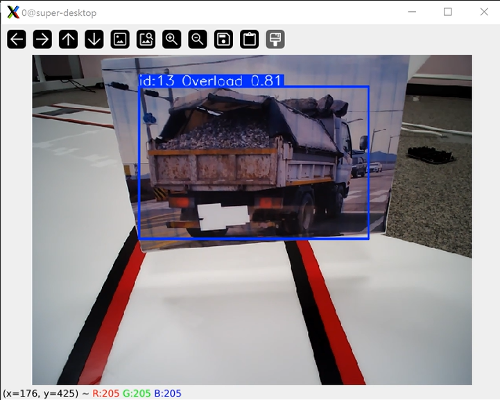
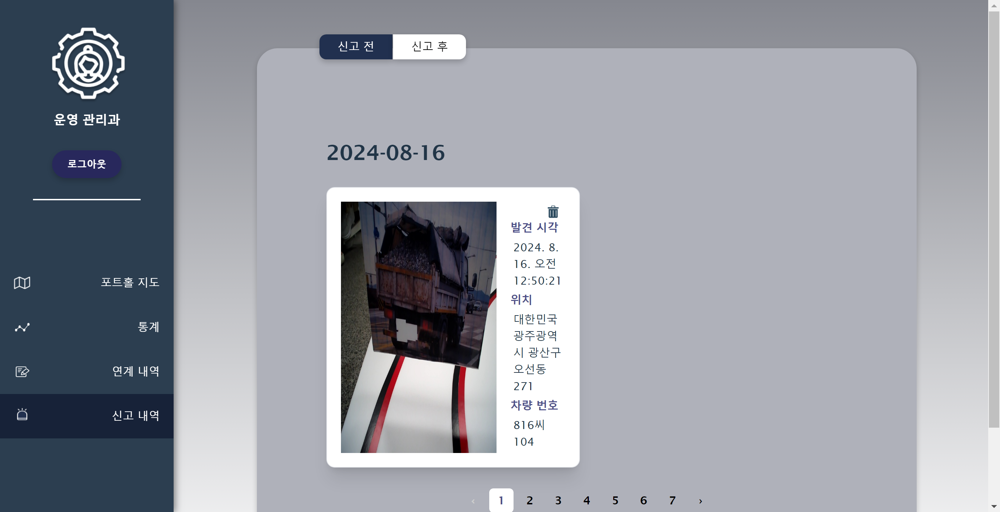
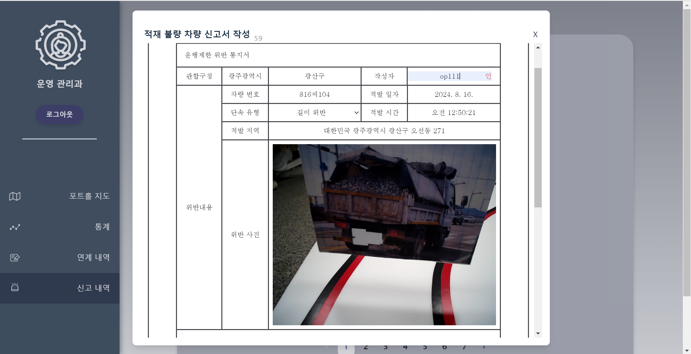
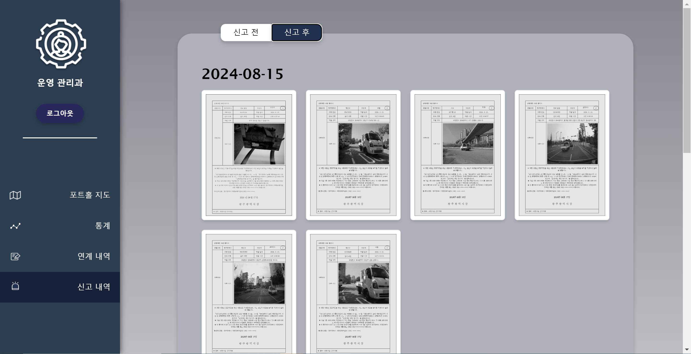
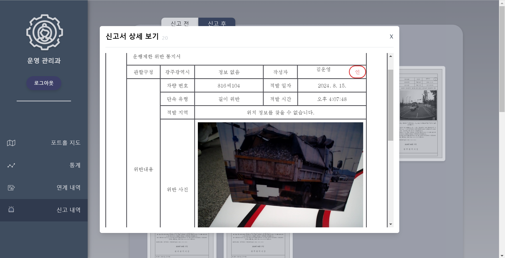
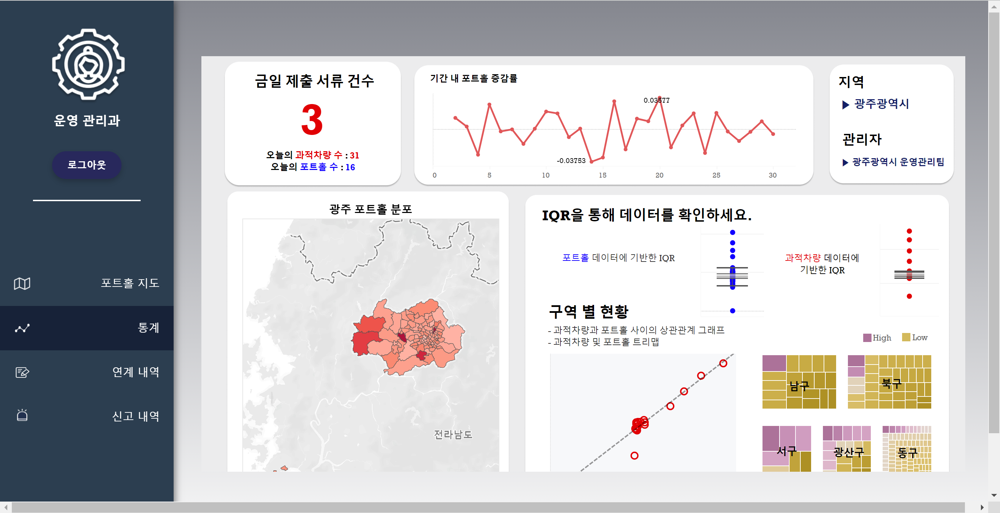

<table align="center">
<tr>
<td align="center">

</a>
</td>
</tr>
</table>

### [로드 가디언즈 🖱](https://i11c104.p.ssafy.io/)

## Index
#### &emsp; [➤ 프로젝트 소개](#-프로젝트-소개) 
#### &emsp; [➤ 프로젝트 설계](#-프로젝트-설계) 
#### &emsp; [➤ 기능 소개](#-기능-소개) 
#### &emsp; [➤ 산출물](#-산출물) 
 

# 🚔 프로젝트 소개

## 서비스 소개
**On-Device AI를 활용한 도로 관리 시스템**
1. ???Lane Detection을 통한 차량 주행
2. On-Device AI를 통한 포트홀, 과적 차량 탐지
3. 실시간 포트홀 모니터링 및 관리
4. 과적 차량 적발
5. ????통계
 

## 프로젝트 기간

| 프로젝트 기간 | 2024.07.08 ~ 2024.08.16 (6주) |
|---|---|
 

## 팀 소개
<table>
  <thead>
    <tr>
      <th style="text-align: center;">박건국</th>
      <th style="text-align: center;">정우영</th>
      <th style="text-align: center;">정하림</th>
      <th style="text-align: center;">강효린</th>
      <th style="text-align: center;">박민철</th>
      <th style="text-align: center;">지민경</th>
    </tr>
  </thead>
  <tbody>
    <tr>
      <td style="text-align: center;">Leader / EM</td>
      <td style="text-align: center;">EM / BE</td>
      <td style="text-align: center;">BE / Infra</td>
      <td style="text-align: center;">FE / Design</td>
      <td style="text-align: center;">AI / FE</td>
      <td style="text-align: center;">FE / Data Viz </td>
    </tr>
  </tbody>
</table>
 

## 기획 배경
포트홀 현상이 급증하면서 사회적 문제로 부각되고 있다. 
최근 2년간 접수된 ‘포트홀’ 관련 민원은 총 52,262건이며, 2024년 1월부터 포트홀 민원은 전년 같은 기간에 비해 약 5.8배 증가했다.
  
 

"신고에 의존하는 포트홀 관리" 
&rarr;&nbsp;늦은 대응

"도로 관리 현재 지자체별 상이한 체계, 한정된 인력" 
&rarr;&nbsp;비효율적 체계

"과적차량 운행으로 인한 포트홀 심화" 
&rarr;&nbsp;근본적인 저감 방안의 부재

 

"포트홀을 빠르게 탐지 및 보수" 하고, "과적 차량 단속 강화"로 근본적인 포트홀 저감 할 수 있는 시스템이 필요하다.

 

  
 

# 🚔 프로젝트 설계
## 개발 환경
<h3>Embedded</h3>
 

<h3>AI</h3>

 

<h3>Frontend</h3>

<h3>Backend</h3>

 

<h3>Infra</h3>

 

 
 

 

<버전 정보>  
Python : 3.9.19 &nbsp;
Opencv-Python 4.10.0 &nbsp;
pytorch : 2.3.1 
React : 18.3.1 &nbsp;
Tableau : 8.2.62  
Java : 17.0.11 &nbsp;
Spring boot : 3.3.2 &nbsp;
MySQL : 8.0.39  
Ubuntu : 20.04.6 LTS &nbsp;
Docker : 27.1.1 &nbsp;
NGINX : 1.18.0 

<h3>협업 툴</h3>

 
  
 

# 🚔 기능 소개

### 1.Lane Detection을 통한 차량 주행

1.1 차선 탐지...

- OpenCV를 기반으로 차선을 나타내는 색인 빨간색 픽셀 값을 검출하여 차선을 그림으로써 차선들의 평균 기울기 값을 기반으로 조향각을 계산하여 차량의 자율 주행 기능을 수행함

### 2. On-Device AI를 통한 포트홀, 과적 차량 탐지

2.1 포트홀 탐지...

2.2 과적 차량 탐지...

- Yolov8 모델을 사용하여 과적 차량 및 포트홀 데이터를 학습시킨 후 Object Tracking 모드를 통해 각 객체를 검출 및 추적함

### 3. 실시간 포트홀 모니터링 및 관리

3.1 포트홀 지도

3.2 포트홀 보수 작업 지시

3.3 포트홀 보수 작업 경로 생성

3.4 포트홀 보수 작업 모니터링

### 4. 과적 차량 적발

4.1 과적 차량 적발 리스트

#### 적발된 과적 차량 리스트 ####
- 확인 가능 데이터 : 적발된 과적차량 이미지, 발견 시각, 위치, 차량 번호
- 기능
  1. AI가 탑재된 자율 주행 차량을 통해 적발된 과적차량의 데이터 확인
    - 요일 별 적발 차량 확인
  2. 적재 불량 차량 신고서 자동 작성 폼 제공
    - 작성자 확인 및 단속 유형 선택 후, 신고서 제출

4.2 과적 차량 신고 

#### 제출된 신고서 확인 리스트 ####
- 확인 가능 데이터 : 신고된 과적차량 이미지, 발견 시각, 위치, 차량 번호
- 요일별 제출된 신고서 리스트 확인
  - 작성자, 차량 번호, 적발 일자, 적발 시간, 단속 유형, 차량 사진

### 5. 통계 (DATA VISUALIZATION)

5.1 통계 

#### 태블로와 figma를 활용한 데이터 시각화 ####
- 사용 데이터 : 광주광역시 내 과적차량, 포트홀 데이터
- 시각화 내용
  1. 기간 내 포트홀 증감률
    - 라인 차트를 활용한 전날 대비 포트홀 증감률
  2. MAP
    - 기하도형.shp + 포트홀 위도,경도 데이터
    - 행정동별 채도 차이를 통해 포트홀 분포 확인
  3. IQR 그래프
    - 사분위수 범위(IQR)을 통한 중앙값, 이상치 파악
    - 타 행정동 대비 행정동별 포트홀 현황
  4. Correlation
    - 포트홀과 과적차량 사이 상관관계 확인
    - R-Squared, Correlation Coefficient > 과적차량과 포트홀 사이의 강한 양의 상관관계 확인
  5. Tree Map
    - 광주광역시 구 별 포트홀, 과적차량 현황 시각화
    - 보라색(포트홀, 과적차량 多) <=> 금색

# 🚔 산출물

##### [⚙ Architecture](https://lab.ssafy.com/s11-webmobile3-sub2/S11P12C104/uploads/c98e7b45383f15041a297bb1a1b30956/%EC%95%84%ED%82%A4%ED%85%8D%EC%B2%98.png)

##### [⚙ ERD](https://lab.ssafy.com/s11-webmobile3-sub2/S11P12C104/uploads/57503f0ad6bc4c16fa530a4947aec5fd/Entity_Relationship_Diagram__1_.jpg)

##### [📋 요구사항 명세서](https://olive-bedbug-5a3.notion.site/40f35404a065441985d2ec0eb3b14caf)

##### [📋 API 명세서](https://olive-bedbug-5a3.notion.site/API-2e721ae0c1474faa8d40a807dec25bb9)

  

##### [🎞 UCC](https://www.youtube.com/watch?v=Cw1PPle6WDQ)

  

### 커밋 컨벤션
- feat : 새로운 기능 추가
- fix : 버그 수정
- hotfix : 급하게 치명적인 버그 수정
- docs : 문서 수정
- style : 코드 포맷팅, 세미콜론 등의 스타일 수정(코드 자체 수정 X)
- refactor : 프로덕션 코드 리팩토링
- test : 테스트 코드, 테스트 코드 리팩토링
- chore : 빌드 과정 또는 보조 기능(문서 생성 기능 등) 수정
- rename : 파일 혹은 폴더명을 수정하거나 옮기는 작업만인 경우
- remove : 파일을 삭제하는 작업만 수행한 경우
- comment : 필요한 주석 추가 및 변경

