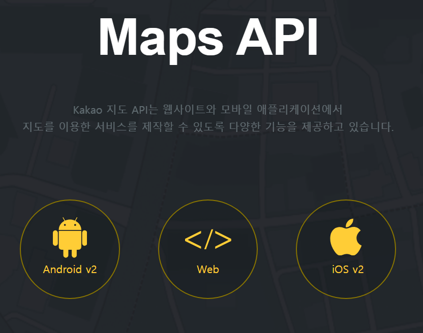
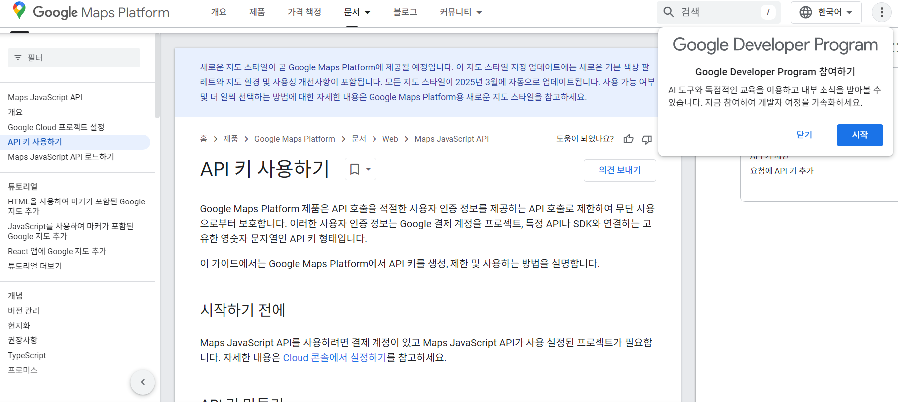

## 프로젝트에서 사용하는 외부 서비스 정보
---

### Kakao Map API

- 해당 Kakao Maps API는 **"운영 관리과 - 포트홀 지도"**, **"작업 보수과 - 작업 지도"** 기능에서 사용됩니다. 
---

### Kakao mobility Developers

- 해당 Kakao Mobility Developers API는 **"작업 보수과 - 작업 지도 - 작업 경로 생성"** 기능에서 사용됩니다.

---
### Google Maps API

- 해당 Google Maps API는 **"운영 관리과 - 포트홀 지도 - 포트홀 상세보기"**, **"운영 관리과 - 연계 내역"**, **"운영 관리과 - 신고 내역"**, **"작업 보수과 - 작업 지도"**, **"작업 보수과 - 연계 내역"** 기능에서 POINT 자료형을 지오코딩하여 도로명 주소로 변환하는데 사용됩니다.