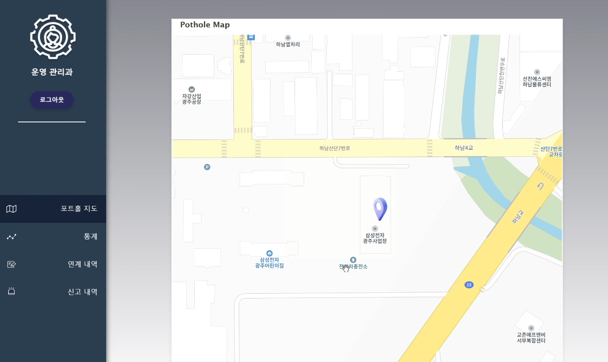
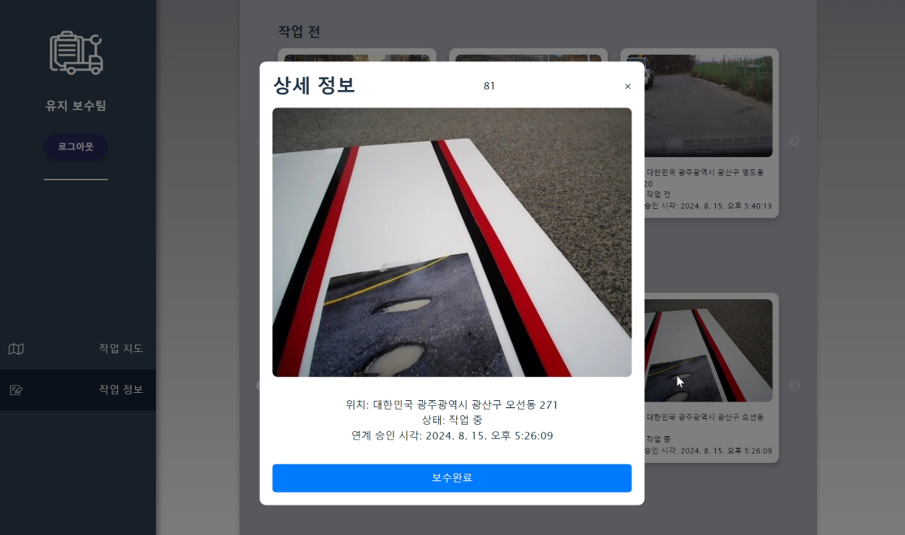
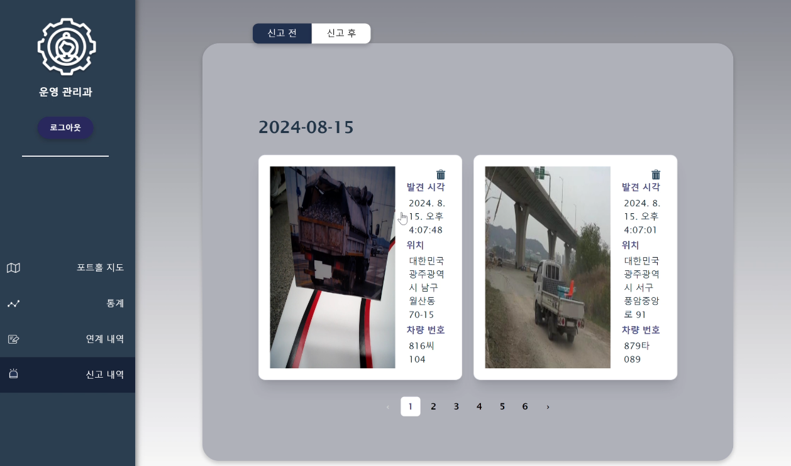
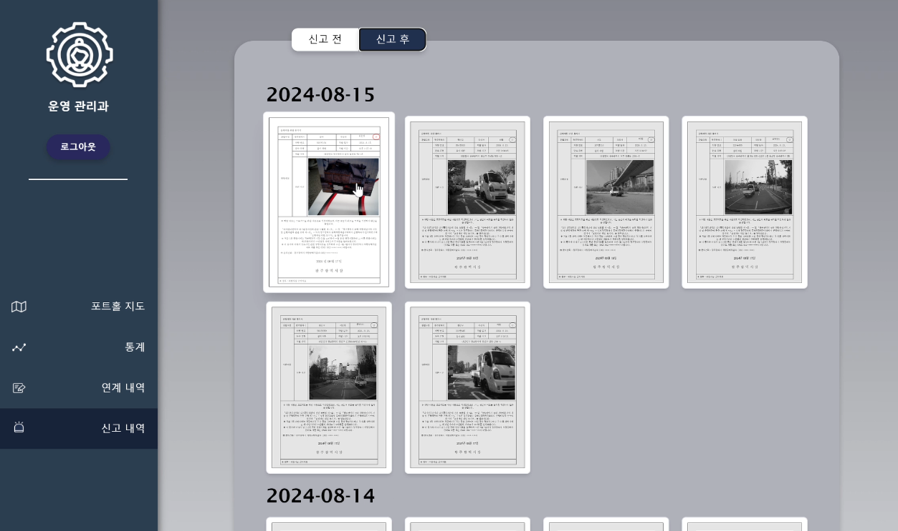

## 시연 시나리오
---

### 운영 관리과 로그인

- 웹 시연에 앞서, 먼저 운영 관리과부터 로그인 진행을 합니다.
- 로그인 ID, 로그인 비밀번호는 (op104, rkeldjswmop) 입니다.

---

### 운영 관리과 지도 활용

- 포트홀 지도를 활용하여 무인 차량이 도로 위의 포트홀을 감지하면, 포트홀 마커가 생기게 됩니다.

- 이를 클릭하면 포트홀의 상세 정보와 유지 보수과에 작업을 지시할 수 있습니다.

- 포트홀 마커를 클릭한 후, 작업 지시하기 버튼을 누르면 

- 해당 포트홀에 대해서 작업 지시를 재확인합니다.

- 해당 클릭을 통해, 포트홀을 유지 보수과에 작업 지시할 수 있습니다.

---

### 운영 관리과 연계 내역

- 포트홀 지도에서도 작업 지시를 할 수 있지만, 연계 내역에서도 확인해서 급히 처리해야할 포트홀을 확인해 작업 지시할 수 있습니다.

- 오탐지 되거나 공사가 필요한 포트홀이 아니라고 생각되면, 삭제 할 수 있습니다.

- 또한, 연계 후 페이지를 확인해 보면, 방금 작업 지시를 내렸던 포트홀 뿐만 아니라 지금 작업을 진행 중인, 완료된 포트홀의 정보를 확인할 수 있습니다.
- 방금 작업 지시를 했던 포트홀이 있기에 유지 보수과로 로그인하여 작업을 진행해보도록 하겠습니다.

---

### 유지 보수과 로그인

- 운영 관리과에서 작업 지시를 한 포트홀 유지 보수과에서 작업 진행을 할 수 있습니다.
- 다른 사용자가 새로운 브라우저에서 유지 보수과로 로그인 진행을 합니다.
- 로그인 ID, 로그인 비밀번호는 (ma104_g, rkeldjswmmag) 입니다.

---

### 유지 보수과 작업 지도

- 처음 유지 보수과에 들어오면, 해당 관할 구역의 지역의 중앙에서 지도가 시작됩니다.

- 작업지도에서 마커를 클릭하면, 클릭한 순서에 따라서 작업 경로를 생성할 수 있습니다.

- 작업 경로를 생성하게 되면, 맵에 있었던 마커들이 사라지고, 유지 보수과의 작업 내역에서 작업 내역을 확인할 수 있습니다.

---

### 유지 보수과 작업 내역

- 작업 내역 페이지를 들어가게 되면, "작업 전", "작업 중" 상태의 포트홀 정보를 확인할 수 있습니다.

- 포트홀 "작업 중"의 포트홀을 클릭하며, 해당 포트홀을 보수 완료 버튼을 통해 작업 완료를 해, 해당 포트홀을 "작업 완료" 상태로 만들어 리스트에서 제거됩니다.

- 이제 포트홀과 관련된 시나리오는 끝났습니다.
  다시 운영 관리과 페이지로 가서, 시나리오를 계속 진행하겠습니다.
---

### 운영 관리과 신고 내역

- 신고 내역 페이지에 들어가면, 신고서 작성 전 적재 불량 탐지 차량을 확인할 수 있습니다.

- 적재 불량 탐지 차량을 클릭하게 되면, 신고서 작성 페이지로 들어가 로그인 담당자의 이름을 확인하고, 신고서를 작성 완료할 수 있습니다.

- 신고 후 페이지로 가서 갤러리 형태로 작성했던 신고서들을 재확인할 수 있습니다.

---

### 운영 관리과 통계

- 운영 관리과에서 통계 페이지를 누르게 되면, 데이터를 기준으로 만들어진 태블로 화면을 통해
구역별 포트홀 발생 지도, 기간별 포트홀 발생, 포트홀과 과적 차량의 상관관계지수, 행정구역(동별) 포트홀 발생 개수 등을 확인할 수 있습니다.

## 이상 시연 시나리오 마치겠습니다.

